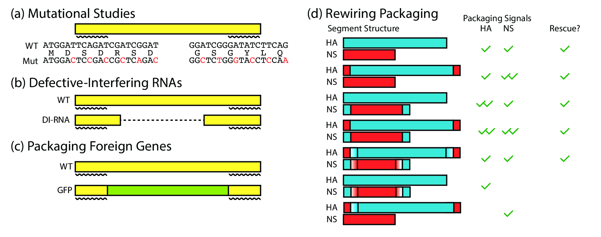

# A Primer on the Influenza A Virus

## The Importance of Studying the Evolution and Ecology of the Influenza Virus

The influenza A virus has inflicted economic and social damage annually on the order of X billions of dollars (#factcheck, #cite). Being a pathogen with zoonotic origins [^zoonotic], it is imperative to study its circulation, evolution and pathogenesis not only in humans, but also in animals (domestic and wild).

In this thesis, I outline efforts with my colleagues to map out and identify reassortant viruses at a global scale, and use this systematic, global identification to learn more about influenza, reticulate evolution, and ecology.

[^zoonotic]: Being of zoonotic origin means that the virus' reservoir is in one or more animal hosts, but "spills over" into humans upon contact. As such, humans are the "spillover host".

## Genome Structure & Evolution

The influenza A virus is a negative strand RNA virus, comprised of 8 genomic RNA segments. Its negative strandedness means that it encodes the strand opposite the messenger RNA (mRNA), implying that it needs to first be copied into mRNA before translation can occur. Together, the RNA segments encode its polymerase (PB2, PB1, PA, NP), viral entry and release proteins (HA, NA), a matrix protein (M) and a non-structural protein (NS) (#figure).

Being an RNA virus that carries its own RNA-dependent RNA polymerase, the influenza A virus is prone to copying errors during replication inside a host cell (#cite). This 'sloppiness' allows the influenza virus to evolve rapidly, and can be thought of as an **evolutionary drift**.

Evolutionary drift coupled with selection contributes to the difference in evolutionary rates that are observed between the external and internal genes. The HA and NA genes are thought to be under immune selection, as they are the external proteins that are targeted by the immune system. The HA and NA proteins, therefore, evolve under dual constraints: they have to continue functioning for cellular entry and release, while also evolve novel epitopes that can successfully evade immune system detection. Evolutionary drift in the HA and NA genes contribute to **antigenic drift**, in which the antigenic characteristics of these two proteins slowly evolve over time; under the assumption that current immunity does not adapt, the current strains gradually become non-targetable by standing population immunity. On the other hand, the internal proteins do not function under such selective pressures, and as such are much more highly conserved.

Evolutionary drift is not the only mechanism by which influenza evolves. Its segmented and independently assorting genome allows for **reassortment** as a complementary mode of genomic evolution. Reassortment is thought to be the process resulting from co-infection of two viruses infecting the same host at the same time. If, for example, a red virus and a blue virus were to co-infect the same host cell, the progeny virus would contain any one of 2<sup>8</sup> combinations of red and blue segments (inclusive of the original viruses themselves) (#figure). Reassortment, thus, can be viewed as a form of **evolutionary shift**[^evoshift] in the genomic structure of the virus.

[^evoshift]: Amongst influenza researchers, evolutionary shift almost always refers to the exchange of HA and NA genes to produce viruses with an immunologically novel HA/NA combination. However, in this thesis, evolutionary shift refers more broadly to the exchange of any of the genes resulting in a novel genotype combination.

## Phylogenies

The evolutionary history of the influenza virus can be visualized using phylogenies. Phylogenetic trees are a reconstruction of the life history of a virus, and is based on two core concepts in evolutionary biology: common ancestry and descent with modification. There have been three major advances in the history of inference of phylogenies using gene sequence data:

1. Maximum parsimony (non-statistical reconstruction)
2. Maximum likelihood (statistical point estimation of a tree)
3. Bayesian inference (statistical reconstruction of ensemble of trees)

Tree construction is done as follows: given a matrix of **character states** (columns) against **samples** (rows) that are assumed to be independently evolving (#figure), we want to find the tree representation of the distance matrix that best reconstructs the evolutionary history of the samples (#figure). Prior to the advent of molecular sequence information, the character states that were used were morphological features, such as wings span and bone sizes. With the advent of molecular sequence data, multiple sequence alignments are used as the input data, with the character states being the individual positions[^charevolve].

[^charevolve]: The assumption that character states evolve independently is still used in modern phylogenetic analyses, even though we know that this does not necessarily hold true, such as in the case of co-evolving sites due to epistatic interactions in a protein.

### Maximum Parsimony

Maximum parsimony methods for phylogenetic reconstruction follow the logic of "the more similar we look, the closer our common ancestor is". A toy example is shown below. (#figure) Consider the example where we have the following three samples with 3 binary character states recorded:

```{include.table=./tables/phylogenetics.md}
```

Using the principle of parsimony, we may compute a distance matrix as follows:

```{include.table=./tables/phylogenetics-distmat.md}
```

There are two trees that may be reconstructed from this data:


### Maximum Likelihood

One of the problems with maximum parsimony methods is that mutational reversions can occur. When a nucleotide changes from A to T, it can continue to mutate to a G or a C, or can revert back to an A. Many generations of replication forward, the edit distance (Hamming or Levenshtein) between the progeny and the original reaches a plateau (+@fig:hamming). When reversions occur, using maximum parsimony to infer evolutionary history masks these reversion events.

{#fig:hamming}

Thus the concept of a "molecular clock" was developed, allowing the statistical inference of relative divergence times given sequence data.

- molecular clock

### Bayesian Inference

- Alexi Drummond's key paper in 2001

## Inferring Reassortment

Reassortment is classically inferred by **tree incongruence**. Tree incongruence can be visualized as in Figure X (#figure). Let us consider the example in Figure X as a

## Genome Packaging

In the study of the process of reassortment, one cannot escape from the topic of "how viruses are packaged". I have detailed the current best knowledge in the field in the appendix, as it is not a central and necessary piece of knowledge for understanding influenza reassortment at a global scale. However, for the uninitiated, the major key points are as follows:

1. There are "packaging signals" located in the coding sequence (imposing a further evolutionary constraint) that determine whether a piece of RNA is selectively packaged into the viral genome. (#cite) (+@fig:packaging)
1. Selective packaging is shown via electron microscopy, where the vast majority of viral particles have a distinct "7+1" arrangement of segments. (#cite)
1. Packaging signals have been exploited to generate influenza viruses that carry GFP rather than one of the genomic segments, allowing for tracking of viral replication. (#cite) This remains, to date, the strongest evidence in favour of the presence of packaging signals that are part of the coding sequence of each of the 8 genes.


{#fig:packaging}


----

1. Current best knowledge on reassortment mechanism at the cellular level.
    1. Summarize at a higher level of abstraction that the “host” level is what is necessary for understanding the problem.
1. Phylogenetic trees: inference, structure, interpretation.
    1. Concepts to cover: patristic distance (branch length from isolate to isolate), very important for understanding algorithm claim 1.
    1. Inference of branching, meaning of “time of most recent common ancestor”, how it’s inferred - evolutionary rate models.
1. Reticulate evolution & reassortment: inference by tree discordance.
    1. Current software available for doing so, and a brief summary of their logic.
        1. GiRaF
        1. Reassortment Networks
        1. 3rd codon biases
1. Importance of reassortant viruses: pandemics, immune evasion.
    1. Measures of fitness - “what is a “fit” virus?” relative to others? Quasispecies concept.
    1. What barriers to replication and infection do the host provide that the virus needs to overcome?
1. Influenza geographical distribution & host range - provides necessary background knowledge for Application 2.
    1. Reservoir hosts - wild animals
    1. Spillover hosts - humans
    1. Intermediate hosts - farm animals
1. Problem description:
    1. Can we identify reassortant viruses at scale?
    1. What can we learn from the detection of reassortant viruses at scale?

# Algorithm

## Description

At a high level, the reassortment detection algorithm works as such. Given a set of sequences, we wish to identify, using the rule of maximal similarity on some given metric, the most likely source of each segment in a virus. Sources, by definition, have to occur prior in time to the virus under consideration. We try to maximize the source similarity score of a virus while minimizing the number of sources needed to explain its existence.

We adapted the SeqTrack algorithm [@Jombart:2011iu] to perform graph construction. Sequences were aligned using Clustal Omega 1.2.1 [@Sievers:2011fn], and the resultant distance matrix was converted into a similarity matrix by taking 1 - distance. Affinity propagation [@Frey:2007hs] clustering was performed on each segment’s similarity matrix to determine a threshold cutoff similarity value, defined as the minimum (across all clusters for that segment) of minimum in-cluster pairwise identities, below which we deemed it implausible for an evolutionary descent (clonal or reassortment) to have occurred (#figure). Because the affinity propagation algorithm does not scale well with sample size, we treated the threshold computation as an estimation problem, and the final threshold was computed as the median threshold of 50 random subsamples of 500 isolates.

We then thresholded each segment’s similarity matrix on the basis of its segment’s threshold value, summed all eight thresholded similarity matrices, and then for each isolate, we identified the most similar isolate that occurred before it in time. This yielded the initial “full complement” graph without reassortant viruses. Each edge in this graph has an attached pair- wise identity (PWI), which is the sum of PWIs across all eight segments. Within this graph, there are isolates for which no “full complement” of segments could be identified, which are candidate reassortant viruses. In addition, among the isolates for which a full complement of segments could be found from another source, we identified those whose in-edges were weighted at the bottom 10% of all edges present in the graph, which we also identified as candidate reassortant viruses (1,357 of 1,368 such viruses were eventually identified as reassortant; the other 11 were considered to be clonally descended). For these viruses, we performed source pair searches, where we identified sources for a part of the genome from one virus and sources for the complementary part of the genome from another virus. If the summed PWI across the segments for the two viruses was greater than the single-source search, we accepted the source pair as the candidate reassortant.

The algorithm is also expressed in the following three-part pseudocode.

```
# Part 1: Compute pairwise identities between all viral isolates' segments.
for each segment in all_segments:
    compute all pairwise identities (PWIs) between each pair of viral isolates
    cluster all isolates based on segment's similarity scores
    compute threshold score as the minimum of all minimum in-cluster PWI
    set to NULL all scores below threshold

initialize empty graph

for each isolate in all_isolates:
    get other isolates that occurred prior in time to this isolate
    filter isolates such that there are no NULL PWI values
    sum up PWI values
    find maximally similar isolate(s) and add edge between isolate(s)

# re-check isolates
for each edge in graph:
    if edge PWI less than 10th percentile of all PWI scores:
        get other isolates that occurred prior in time to this isolate
        filter isolates such that there are no NULL PWI values
        find pair of isolates whose complementary segments maximizes PWI
        if new max PWI score > existing edge PWI score:
            replace single-source edge(s) with two-source edge(s)
```

Pairwise identities were computed using Clustal Omega (version 1.2.1) [@Sievers:2011fn]. The algorithm is implemented in the Python programming language (version 3.5); main packages used included NetworkX, `numpy`, `pandas`, and `matplotlib` for visualization. The source code is archived on Zenodo (DOI: 10.5281/zenodo.33421).

## Simulation Studies

To check whether the algorithm was capable of correctly identifying reassortant viruses, simulation studies were conducted. To simplify the problem, we considered the case of a two-segment virus, with each of the two segments having a different nucleotide substitution rate, mirroring the different substitution rates on each of the influenza genome segments. Each simulation run was initialized with anywhere between one and five viruses. At each time step, one virus was chosen at random to replicate (with 0.75 probability) or reassort with another virus (with 0.25 probability). Simulations were run for 50 time steps.

Regardless of replication or reassortment, the progeny virus was subjected to mutations, with the number of mutations in each segment being drawn from a binomial distribution with probability equal to the segment's substitution rate, and the exact positions drawn uniformly across the segment. This process is outlined in figure X (#figure).

The number of unique starting genotypes and total number of viral isolates being considered was much smaller than the real-world data. Therefore, our graph reconstruction procedure captured the essential parts of the method used in the global analysis, but differed in the details. Here, “full complements” involve only two segments. We did not perform affinity propagation clustering, as we started with completely randomly generated sequences of equal length. Our “null model” graph is where source isolates are chosen uniformly at random from the set of nodes occurring before the sink isolates.

To assess the accuracy of our reconstruction, we defined the path accuracy and reassortant path identification accuracy metrics (#figure). Edge accuracy, which is not used for evaluation here, is whether a particular reconstruction transmission between two isolates exists in the simulation. Path accuracy is a generalization of edge accuracy, where a path existing between the source and sink nodes (without considering the direction of edges) in the reconstruction is sufficient for being considered accurate. Reassortant path identification accuracy measures how accurately we identified the reassortant paths, analogous to the regular path accuracy.

Source code for the simulation studies is availble on Zenodo (DOI: 10.5281/zenodo.33427).

## Complexity Analysis

According to Feltenstein [@Feltenstein:2004ws], given a set of `n` nodes, the number of possible rooted, bifurcating trees (which are used for inferring tree inconrguence) is

$$ \frac{2n-3!}{2^{n-2}(n-2)!} $$

# Applications

## Application 1: Global reticulate evolution study.

### Introduction

Reticulate evolutionary processes, such as horizontal gene transfer and genomic reassortment, have been proposed as a major mechanism for microbial evolution [@HernandezLopez:2013dd], aiding in the diversification into new ecological niches [@Peris:2014in]. In contrast to clonal adaptation through genetic drift over time, reticulate evolutionary processes allow an organism to acquire independently evolved genetic material that can confer new fitness-enhancing traits. Examples include the acquisition of cell surface receptor adaptations (point mutations) in viruses [@Garten:2009ip] and antibiotic resistance (single genes) [@Smillie:2011jc] and pathogenicity islands (or gene clusters) in bacteria [@Antonenka:2005jea].

Host switching, defined as a pathogen moving from one host species into another, represents a fitness barrier to microbial pathogens. The acquisition of adaptations through reticulate processes either before or after transmission from one species to another may serve to aid successful pathogen host switches by improving fitness and the likelihood of continued transmission [@Remold:2008fl]. In this sense, reticulate evolution may be viewed as an ecological strategy for switching between ecological niches (such as different host species), complementing but also standing in contrast to the clonal adaptation of a microbial pathogen by genetic drift under selection. To test this idea and its importance in host switch events, which are critical for (re)-emerging infectious disease, we provide a quantitative assessment of the relative importance of reticulate processes versus clonal adaptation in aiding the ecological niche switch of a viral pathogen.

Data yielded from influenza genome sequencing projects provide a unique opportunity for quantitatively testing this concept and are suitable for the following reasons. First, the influenza A virus (IAV) has a broad host tropism [@Webster:1992wl] and is capable of infecting organisms spanning millennia of divergence on the tree of life. With different host-specific restriction factors forming an adaptive barrier, each host species may then be viewed as a unique ecological niche for the virus [@Duggal:2012jna]. Second, IAV is capable of and frequently undergoes reassortment, which is a well-documented reticulate evolutionary process [@Li:2010fd; @Mehle:2012ei; @Lam:2011jk; @Tao:2014ik]. Reassortment has also been implicated as an adaptive evolutionary mechanism in host switching [@Ince:2013kc; @Steel:2014ef], although this is most prevalently observed for pandemic viruses of public health interest for which sequences are available [@Furuse:2010bl]. Finally, as a result of surveillance efforts during the last 2 decades, whole-genome sequences have been intensively sampled during a long time frame, with corresponding host species metadata, available in an easily accessible and structured format [@Squires:2012fx]. Because reassortant viruses are the product of two or more genetically distinct viruses coinfecting the same host, a more complex process than clonal transmission and adaptation, they are expected to occur less frequently. Hence, the global IAV dataset, which stretches over time and space with large sample numbers, provides the necessary scope to detect reassortant viruses at a scale required to quantitatively assess the relative importance of reticulate events in viral host switching.

### Method Validation

We used the phylogenetic heuristic algorithm (described in the Algorithm section) to reconstruct an approximate global phylogeny for all 18,000+ fully-sequenced viruses in the dataset. In this network of viral isolates, clonal descent is mostly structured by host species, with known global patterns of human-to-human (H3N2 & H1N1, and rarer H5N1 & H7N9), chicken-to-chicken (H9N2, H7N9, H5N1) and swine-to-swine (H3N2, H1N1, H1N2) viral circulation captured in the network reconstruction (Figure S1)(#edit). Edges in the network connected viral isolates with a median genetic similarity of 99.7%, indicating a high degree of genetic similarity captured in the network-based reconstruction (Figure S2)(#cite). As expected, no clonal descent was identified between viruses of different subtypes. Moreover, the network recreates the phylogeny of known reassortant viruses, including the 2009 pandemic H1N1 and the recent 2013 H7N9 viruses, further validating the accuracy of our reconstruction (a browser-based d3.js visualization is available in Zenodo archive of the Github repository (Materials & Methods) (#edit)). Small-world simulation studies validated our method as being accurate in detecting reassortment events (Figure S4)(#edit), while a comparison of edges to a phylogenetic reconstruction on a subset of the data show that our method captures the shorter end of the distribution of patristic distances on a tree, indicating accurate approximation to phylogenetic reconstruction (Figure S3)(#edit). Hence, our method is capable of detecting reassortment events, which are classically inferred by observing incongruences in phylogenetic tree clustering.

### Results

To test whether reassortment or clonal descent was an advantageous strategy when switching hosts, we computed the weighted proportion of reassortant edges (out of all edges) occurring between hosts of the same or different species. When host species were different, reassortant edges were over-represented at 19 percentage points above a null permutation model (permutation test described in Materials & Methods)(#edit) (Figure 1a)(#edit), and when host species were the same, reassortant edges were under-represented by 7 percentage points relative to our null model. Thus, reassortment is a strongly favoured strategy when influenza crosses between different host species.

We further sought to explore whether the predominant use of reticulate evolutionary processes in host switch events were correlated with host phylogenetic relatedness and host ecology. To do this, we first computed the proportion of reassortment when switching between birds, non-human mammals, or humans, which are 3 divergent host groupings with distinct ecological behaviour. (For example, humans are the only known species to employ disease control measures, and affect the ecology of other species (birds and mammals through domestication) at scale.) We further sub-divided avian and mammalian categories into wild and domestic, to assess the impact of anthropological activity on the relative importance of reassortment in host switch interfaces (see Materials and Methods for how AIV was classified as domestic or wild). To ensure that the dataset was sufficient in scope to detect reassortant viruses, we only considered host group transitions with at least 1000 descent events (both clonal and reassortant), or at least 10 reassortment events (dashed yellow and green lines respectively in Figures 1b & c) (#edit). Nonetheless, all data are displayed for completeness.

Here, reassortment is over-represented relative to the null when host groups are different. Only two exceptions occur. The first is between wild birds, where reassortment is over-represented but host groups are not different. In this case, the “wild bird” label encompasses a wide range of host species, and as the natural reservoir for many diverse influenza viral subtypes, we expect to detect reassortment events more frequently between diverse species that may be distantly evolutionarily related.

The second is the human-domestic mammal interface, where reassortment is not over-represented even though the host groups are different. In the case of human to domestic mammal host switches (reverse zoonosis), these are mostly well-documented reverse zoonotic events between human and swine hosts (18)(#edit)), where shared cellular receptors for viral entry (19)(#edit) facilitates zoonotic and reverse zoonotic transmission. This may be a case of host convergent evolution inadvertently lowering the adaptive barrier to host switching. Under representation of reassortment at human-to-human transitions is expected because of the limited number of viral subtypes circulating in human populations that undergo serial selective sweeps, resulting in high sequence similarity within the viral pool (20)(#edit), which likely obscures the distinction between reassortment and clonal descent. However, we also expect antibody-mediated immunity, whether from vaccination or prior exposure, to further limit the frequency of co-infection and likelihood of reassortment events happening amongst humans. Thus, despite the exceptions that may be explained by our current best knowledge of influenza biology (e.g. human to swine transmissions), reassortment is strongly favoured over clonal evolution when crossing between evolutionarily distant hosts.

To further explore the relationship between host evolutionary divergence and the predominance of reassortment in transmission events between species, we compared a common phylogenetic measure of species divergence, the cytochrome oxidase I (COI) gene, to the use of reassortment in host switch events. A subset of viral hosts, encompassing a variety of bird and mammal species, have had their cytochrome oxidase I (COI) gene sequenced as part of the barcode of life project (21)(#edit). For the subset of edges in the network for which both the source and sink hosts have a COI gene sequence that fulfilled our criteria for consideration (as described above), we computed the percentage evolutionary distance between the two hosts (Materials and Methods). Applying a similar permutation test and assessment criteria as described for host groups above, we found a trend of increasing over-representation at higher evolutionary distances (Figure 1c)(#edit). Thus, as host evolutionary distance, or more broadly, as quantitative niche dissimilarity increases, reticulate evolution becomes increasingly favoured for influenza virus niche switch events.

### Discussion

In this study, we have quantitatively defined the importance of reticulate evolutionary events in switching ecological niches, using an infectious disease data set with characteristics that are particularly well suited for answering this question. Beyond the viral world, recent reviews have asserted the importance of reticulate evolutionary events as a driver of speciation and niche diversification (22, 23)(#edit), and recent studies have illustrated heightened fitness effects in hybrid populations (24, 25)(#edit). However, none have quantitatively tested the importance of reticulate evolutionary strategies in enabling ecological niche switches at a global scale, especially in comparison to clonal adaptation under drift and selection (a task feasible only in fast evolving organisms). Additionally, no studies to date have examined reticulate evolutionary processes in the context of quantified niche differences, as we have done here by measuring reassortment in the context of host evolutionary distance. Our study provides strong quantitative evidence supporting the hypothesis that reticulate evolutionary processes are advantageous relative to adaptation by drift for pathogen transfer between host species, and therefore more broadly, ecological niche switching.

There are four limitations to this study. Firstly, we recognize that in this study, we have considered only a single pathogen for which abundant genomic data are available, and whose genomic and host tropic characteristics are suitable for this analysis. To specifically answer whether reticulate processes are favoured over clonal transmission for other organisms, using these methods, depends on being able to acquire genome sequences with matched ecological niche metadata.

Secondly, we also note that the global influenza dataset will have unavoidable sampling biases. For example, human isolates predominate in the dataset, and consequently the human-associated subtypes H3N2 and H1N1 also dominate the dataset. Sequences from viral outbreaks will also be over-represented relative to isolates collected through routine surveillance sampling, and will unavoidably lead to a heightened detection of clonal descent in a single host species. In order to deal with this sampling bias, our permutation tests (for the host species and group labels) involve class labels of equal sizes. This allows us to calculate an expected distribution of proportions under ideal assumptions of equal sampling, which in turn forms the baseline for our conclusions.

Thirdly, our choice to use “host species” as the defined and quantified ecological niche is, in part, borne out of data availability. We naturally expect exceptions to occur if differences between species do not constitute a major barrier, or if barriers are defined by other characteristics of the host. Mallards are one example of such an exception (Figure S7)(#edit). Amongst mallards, pre-existing immunity (perhaps quantifiable by antibody landscapes (26)(#edit)) and high subtype diversity may be a strong driving forces for reassortment (27)(#edit). We note that the necessary data do not currently exist to quantify barriers for other levels of defining and quantifying ecological niches, such as individuals or populations, at a global scale.  

Finally, we do not specifically identify whether reassortment occurs prior to or after host switching, but only identify host transitions across which reassortment is implicated. A reassortment event may occur within a host species, during transfer between two host species, or after the transfer; reassortment’s association with host switching will depend on when the reassortant virus is detected, and consequent clonal expansion of the reassortant strain will be identified as “clonally descended”. Our method does not identify when the reassortment event happens, and this is both a limitation of our method and of IAV surveillance being less dense than necessary to distinguish between these two scenarios. Without better prior knowledge on whether reassortment happens prior to or after host switching, our method assumes that the detected reassortment events are the best possible representation of ground truth. It is with this limitation in mind that we identify associations of reassortment events with host switches, or more broadly across ecological niches. Whether reticulate evolution is causal for ecological niche switching will require further study.

In summary, using data available from a model zoonotic viral pathogen, we have shown that reticulate evolutionary processes are important in enabling pathogen host switches. For the influenza virus, reticulate evolution predominates when crossing between hosts. More broadly, the greater the quantitative difference between ecological niches, the greater the importance of reticulate evolutionary processes in enabling niche switches. While the quantitative importance of reticulate evolution may differ for different organisms evolving in different niches, we expect that further sequencing efforts from across broad domains of microbial life, and a further characterization and definition of their ecological niches, will elucidate whether this principle holds more broadly. Beyond its relevance to evolutionary ecology, reticulate evolution also has public health consequences. Reassortant influenza viruses have been implicated in all past human pandemic strains for which we have sequence data (28-31)(#edit), and the ancestry of HIV-1 involved a hybrid SIV (32)(#edit). Hence, knowing how reticulate events shape disease emergence may help the ecology and evolution of infectious disease become a more predictive science, leading to insight important to disease prevention and mitigation (33)(#edit).

- TODO: Need to describe statistical test, as this is required for a reader to understand how the statistical inference happened.

### Methods

We describe here the methods specifically used for this application.

**Permutation tests.** Null models were constructed by permuting node labels; equal class size permutation was performed for host species (for Figure 1a)(#edit) and host group (for Figure 1b)(#edit). For example, if there were 9 ‘human’, 4 ‘swine’ and 2 ‘chicken’ nodes (15 total), labels would be randomly shuffled amongst the nodes such that each label were equally represented (5 each).

**Host Group Labelling.** Host species were manually classified into the “human”, “domestic animal” and “wild animal” groups, based on the country of isolation. For example, “ducks” would be considered a “wild animal” in North America, while it would be considered a “domestic animal” in East Asian countries. Ambiguous host species, while remaining in the dataset, were excluded from the analysis.

**Host Evolutionary Distance.** Host species’ scientific names were sourced from the Tree of Life database (www.tolweb.org). Only host species with unambiguous scientific names recorded were considered. Cytochrome oxidase I genes were sourced from the Barcode of Life Database (www.boldsystems.org) on 31 October 2015. Sequences had to be at least 600 n.t. long to be considered, and only positions with fewer than 3 gap characters were concatenated into the final trimmed alignment. Evolutionary distance was computed from the trimmed alignment as the proportion of mismatched nucleotides. Further details are available in the Jupyter notebooks.

**Phylogenetic Reconstruction and Patristic Distance Comparison.** Phylogenetic reconstruction was done for a subset of H3N8 viruses isolated from Minto Flats, AK, between 2009 and 2010 as part of a separate study. Briefly, each segment of the viral genomes were individually aligned using Clustal Omega (34)(#edit), and their genealogies reconstructed using BEAST 1.8.0 (36)(#edit). A minimum of 3 MCMC runs that converged on a single optimal tree were chosen to compute the maximum clade credibility (MCC) tree. Burn-in ranged from 10 to 39 million steps out of 40, with median 24 million steps. Patristic distances were calculated using the DendroPy package (37)(#edit). In the graph reconstruction on the Minto Flats study, we extracted the edges and nodes involving only the H3N8 isolates, and computed the tree patristic distances between isolate pairs linked by an edge in the graph.

**Edge Weighting and Proportion Reassortment Calculations.** The proportion of reassortment events was calculated by first weighting each incoming edge to every virus. The weighting procedure is described here: If the virus is detected to be plausibly clonally descended from n other viruses, as determined by maximal similarity, it is given a weight of `1/n` . If the virus is detected to be a reassortant, then edges are weighted by the the fraction of times that it is involved in a max similarity source pair. (Figure S5)(#edit) For example, if a given node A has a plausible source of segments in B, C, D, with (B and C) and (B and D) being plausible sources, then the edge B-A would be given a weight of 0.5, and the edge C-A and D-A would be given a weight of 0.25 each. (Figure S5)(#edit) The proportion of reassortment edges was then calculated by taking the sum of weights across all reassortant edges (for a particular transition, e.g. between or within host species), divided by the sum of weights across all reassortant and clonal edges (for the same particular transition). With this weighting scheme, multiple plausible sources that lead to the same virus are not double-counted.

## Application 2: Viral persistence.

- Research question: is reassortment a favoured strategy for viral gene persistence across wintering seasons?
    - Lead author: Nichola Hill (post-doc in lab).
- Results: reassortment is over-represented for persistence through winter, relative to random chance. Describe statistical test.

Caveats common to both applications: always will have sampling issues with the current sequence database.

# Future Work

## Engineering work

The code, as it stands right now, was designed for execution on a Sun Grid Engine compute cluster. This design enabled manual parallelism wherever the code was embarrassingly parallel. For example, one key step is the creation of a multiple sequence alignment for each influenza A virus segment. Because the the alignment of one segment is not dependent on the alignment of another segment, they could be aligned in parallel, with the alignment of longer segments taking longer than the alignment of shorter segments. However, a few steps after that, there is a "reduction" step that is dependent on having all 8 evolutionary distance matrices computed fully, and this was one example of a step that was not automated because of (1) a lack of expertise in parallel computation and (2) the nature of the SGE scheduling system not being accessible from an external API.

With the development of Python-based software schedulers (e.g. Dask (#cite)) enabling automatic execution of complex, arbitrary computation graphs, a rework of the code could be performed to make it executable with a single command from the command line. Dask has the added advantage of being able to scale from single cores to cloud infrastructure.

## Scientific questions

1. Can we experimentally validate this principle?
1.

# Appendices

## Influenza Packaging

<!-- insert here our current best knowledge on influenza packaging -->

# References

