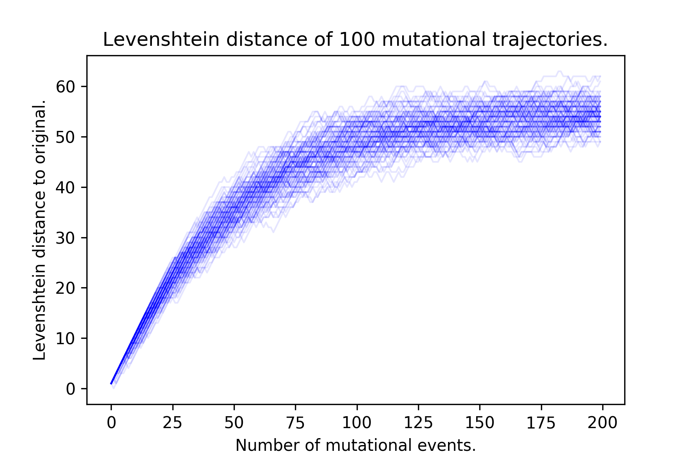

# A Primer on the Influenza A Virus

## The Importance of Studying Influenza Evolution & Ecology

The influenza A virus has inflicted economic damage annually on the order of billions of dollars [@Molinari:2007en]. Being a pathogen with zoonotic origins [^zoonotic], it is imperative to study its circulation, evolution and pathogenesis not only in humans, but also in animals (domestic and wild). One major problem of interest pertains to influenza's ability to shuffle its genome with other influenza viruses, and its implication in the ability of the virus to jump between host species. To address this, in this thesis I outline efforts with my colleagues to map out and identify these shuffled viruses at a global scale, and use this systematic, global identification to learn more about influenza, reticulate evolution, and ecology.

[^zoonotic]: Being of zoonotic origin means that the virus' reservoir is in one or more animal hosts, but "spills over" into humans upon contact. As such, humans are the "spillover host".

## Genome Structure & Evolution

The influenza A virus is a negative strand RNA virus, comprised of 8 genomic RNA segments. Its negative strandedness means that it encodes the strand opposite the messenger RNA (mRNA), implying that it needs to first be copied into mRNA before translation can occur. Together, the RNA segments encode its polymerase (PB2, PB1, PA, NP), viral entry and release proteins (HA, NA), a matrix protein (M) and a non-structural protein (NS) +@fig:genome-structure-reassortment.

{#fig:genome-structure-reassortment}

Being an RNA virus that carries its own RNA-dependent RNA polymerase, the influenza A virus is prone to copying errors during replication inside a host cell [@Holmes:2003wl]. This 'sloppiness' allows the influenza virus to evolve rapidly, and can be thought of as an **evolutionary drift**.

Evolutionary drift coupled with selection contributes to the difference in evolutionary rates that are observed between the external and internal genes. The HA and NA genes are thought to be under immune selection, as they are the external proteins that are targeted by the immune system. The HA and NA proteins, therefore, evolve under dual constraints: they have to continue functioning for cellular entry and release, while also evolve novel epitopes that can successfully evade immune system detection. Evolutionary drift in the HA and NA genes contribute to **antigenic drift**, in which the antigenic characteristics of these two proteins slowly evolve over time. On the other hand, the internal proteins do not function under such selective pressures, and as such are much more highly conserved.

Evolutionary drift is not the only mechanism by which influenza evolves. Its segmented and independently assorting genome allows for **reassortment** as a complementary mode of genomic evolution. Reassortment is thought to be the process resulting from co-infection of two viruses infecting the same host at the same time. If, for example, a red virus and a blue virus were to co-infect the same host cell, the progeny virus would contain any one of 28 combinations of red and blue segments (inclusive of the original viruses themselves) (+@fig:genome-structure-reassortment). Reassortment, thus, can be viewed as a form of **evolutionary shift**[^evoshift] in the genomic structure of the virus.

[^evoshift]: Amongst influenza researchers, evolutionary shift almost always refers to the exchange of HA and NA genes to produce viruses with an immunologically novel HA/NA combination. However, in this thesis, evolutionary shift refers more broadly to the exchange of any of the genes resulting in a novel genotype combination.

## Subtype Classification

Influenza A viruses are classically known by their subtypes, e.g. H1N1, H5N1, H3N2. The "H" stands for the hemagglutinin subtype, for which there are 16 canonically known ones (H1-H16). The "N" stands for the neuraminidase subtype, for which there are 9 canonically known ones (N1-N9). H17N10 and H18N11, two new subtypes that expand our canonical view of the number of viral subtypes, have been isolated from bats [@Wu:2014by].

The hemagglutinin and neuraminidase are proteins expressed on the surface of the viral particle, and as such they are thought to be subject to immune selection and thus evolutionary pressure. This explains why there is such great diversity in the HA and NA genes.

## Phylogenies

The evolutionary history of the influenza virus can be visualized using phylogenies. Phylogenetic trees are a reconstruction of the life history of a virus, and is based on two core concepts in evolutionary biology: common ancestry and descent with modification. There have been three major advances in the history of inference of phylogenies using gene sequence data:

1. Maximum parsimony (non-statistical reconstruction)
2. Maximum likelihood (statistical point estimation of a tree)
3. Bayesian inference (statistical reconstruction of ensemble of trees)

Tree construction is done as follows: given a matrix of **character states** (columns) against **samples** (rows) that are assumed to be independently evolving, we want to find the tree representation of the distance matrix that best reconstructs the evolutionary history of the samples. Prior to the advent of molecular sequence information, the character states that were used were morphological features, such as wings span and bone sizes. With the advent of molecular sequence data, multiple sequence alignments are used as the input data, with the character states being the individual positions[^charevolve].

[^charevolve]: The assumption that character states evolve independently is still used in modern phylogenetic analyses, even though we know that this does not necessarily hold true, such as in the case of co-evolving sites due to epistatic interactions in a protein.

### Maximum Parsimony

Maximum parsimony methods for phylogenetic reconstruction follow the logic of "the more similar we look, the closer our common ancestor is". A toy example is shown below. Consider the example where we have the following three samples with 3 binary character states recorded:

sample  |  char1  |  char2  |  char3
--------|---------|---------|-------
A       |  1      |  1      |  1
B       |  1      |  1      |  0
C       |  1      |  0      |  0

Using the principle of parsimony, we may compute a distance matrix as follows:

sample  |  A  |  B  |  C
--------|-----|-----|---
A       |  0  |  1  |  2
B       |  1  |  0  |  1
C       |  2  |  1  |  0

Of the three possible trees that can be reconstructed, there are two that fit the data best:

{#fig:parsimony-tree}

### Maximum Likelihood

Molecular clock theory essentially states that the number of mutational events observed in a sequence is roughly linearly proportional with time. While in principle, this may seem to suggest that we can use the edit distance (maximum parsimony) to estimate the time of divergence between two sequences, there are problems with this logic.

One of the problems with maximum parsimony methods is that mutational reversions can occur. When a nucleotide changes from A to T, it can continue to mutate to a G or a C, or can revert back to an A. Many generations of replication forward, the edit distance (Hamming or Levenshtein) between the progeny and the original reaches a plateau (+@fig:hamming). When reversions occur, using maximum parsimony to infer evolutionary history masks these reversion events.

{#fig:hamming}

Maximum likelihood methods were developed to deal with this problem. Under the assumption that each site evolves independently, we require three ingredients to compute the likelihood of a given phylogeny: the structure of the tree, an assumed internal node sequence, and a probability of mutation between any given pair of nucleotide states.

Purely for illustrative purposes, and without going into further detail, I show an example with concrete numbers below.

Given the following three samples with the following states:

Sample  |  $seq_{j}$
--------|------------
1       |  A
2       |  A
3       |  C

and the following transition probabilities:

letter  |  A     |  T     |  G     |  C
--------|--------|--------|--------|------
A       |  4/10  |  2/10  |  2/10  |  2/10
T       |  2/10  |  4/10  |  2/10  |  2/10
G       |  2/10  |  2/10  |  4/10  |  2/10
C       |  2/10  |  2/10  |  2/10  |  4/10

and two trees (out of many possible) for this given state:

{#fig:mlt}

We may compute the following log likelihood for each of the trees:

$$L_{tree1}(T) = P(A_4 \rightarrow A_1) \times P(A_4 \rightarrow A_2) \times P(A_5 \rightarrow A_4) \times P(A_5 \rightarrow C_3)$$

Taking a log transform to prevent underflow in computation:

$$log(L_{tree1}(T)) = logP(A_4 \rightarrow A_1) + logP(A_4 \rightarrow A_2) + logP(A_5 \rightarrow A_4) + logP(A_5 \rightarrow C_3)$$

And evaluating the result, we get:

$$log(L_{tree1}(T)) = 3log0.4 + log0.2 = -1.89$$

Doing an analogous computation for tree 2 yields a log likelihood score of -2.19. With maximum likelihood estimation, we would want to find the tree topology that maximizes the log likelihood score, given the underlying transition model.

In principle, this procedure has to be for every possible nucleotide in the internal nodes. The sum of all log likelihood scores gives the log likelihood of the tree, given the sequence at a position $i$ in a multiple sequence alignment. This computation is then repeated for every position in a sequence alignment. This makes maximum likelihood methods computationally more expensive than maximum parsimony methods.

Yet, we run into a problem: it is computationally infeasible to compute the likelihood for every single topology! Not only is the tree space large, according to Felsenstein [@Felsenstein:2004ws]:

$$ \frac{(2n-3)!}{2^{n-2}(n-2)!} $$

the likelihood over every possible reconstructed ancestral sequence has to be computed as well.

Thus, in practice, trees are iteratively built using a greedy algorithm. For brevity, and because it is not relevant to understanding the reassortant virus detection algorithm, here, I do not provide extra detail, though they are available in Felsenstein's book, Inferring Phylogenies [@Felsenstein:2004ws].

### Bayesian Phylogenetic Inference

Bayesian phylogenetic reconstruction methods extend likelihood tree reconstruction methods by allowing us to infer a probability distribution over the tree topology and coalescent times, given the data. When paired with phylogeographic inference [@Lemey:2010eu], where geography is modelled as another character state in addition to nucleotide sequence, it is possible to reconstruct and trace the movement of viruses. As is the case with Bayesian inference in general, the exponential increase in computational power along with advances in tree-space MCMC have been greatly enabling. Bayesian phylogenetic inference has been used successfully to infer the time of emergence of outbreak viruses such as the Ebola virus [@Gire:2014fk; @Park:2015cw] and movement swine influenza viruses [@Nelson:2015dy]. Nonetheless, Bayesian phylogenetic tree construction remains computationally expensive; typical real-world runtimes for tree reconstruction, given single core, GPU-enabled compute power, are on the order of weeks for hundreds of taxa and months for thousands of taxa.

## Interpreting Trees

A bifurcating phylogenetic tree is a directed acyclic graph comprised of leaf nodes (tips), internal nodes, and bifurcating branches at each **internal node** (+@fig:interpreting-trees). Branch lengths indicate evolutionary time elapsed from an internal node to another internal node or leaf.

As with any hierarchical clustering method, the leaves can be organized into **clades** (+@fig:interpreting-trees), which represent a cluster of isolates on the tree that are closely related. How a clade is defined is subjective, and visual observation is the most common way to define a clade.

A metric of evolutionary distance between any two given isolates is the **patristic distance** (+@fig:interpreting-trees) between them. The patristic distance is measured by the sum of branch lengths (in the units that the lengths are defined, or else arbitrary distance) from one isolate to another. As such, isolates that are more evolutionarily related will have a shorter patristic distance between them.

{#fig:interpreting-trees}

## Inferring Reassortment

### Single Virus

Reassortment is classically inferred on a single virus of interest. The logic is essentially presented in +@fig:reassortment.

{#fig:reassortment}

Reassortment can be detected by looking for incongruence in the phylogenetic history of a virus. As a simple example, for the red flu of interest in +@fig:reassortment, two of its three genes share closer evolutionary history with avian flu, while one gene shares closer evolutionary history with human flu. As such, we would infer that this avian virus acquired a human virus' gene through some process of reassortment.

Is it possible to tell in which host a virus was isolated? Given the sparsity of sampling efforts, it is very difficult to tell whether this reassortment was more likely to have occurred inside a human host or an avian host or an intermediate host. The best that we can do is reconstruct the evolutionary history.

### Tree Incongruence

Tree incongruence is another way of identifying reassortant influenza A viruses. Because a bifurcating phylogenetic tree can be defined as a set of splits partitioning the taxa into two sets, "incompatible splits" in the tree can be identified by looking at the partitioned sets and identifying partition sets that have non-null intersections.

Let us look at +@fig:tree-splits for an elementary example. Suppose we had two trees with the same set of taxa, $\{t_1, t_2, t_3, t_4\}$. We observe the following splits:

{#fig:tree-splits}

- The tree with a red split defines a partition of the four taxa into two splits, $A = \{t_1, t_2\}$ and $B = \{t_3, t_4\}$.
- The tree with a yellow split defines a partition of the four taxa into two splits, $X = \{t_1, t_3\}$ and $B = \{t_2, t_4\}$.

If these two trees are incompatible, then all of the following criteria are true:

- $A \cap X ≠ \varnothing$, (i.e. intersection of sets A and X, or set of common items, is not empty)
- $A \cap Y ≠ \varnothing$,
- $B \cap X ≠ \varnothing$, and
- $B \cap Y ≠ \varnothing$.

In the case of this pair of trees:

- $A \cap X = \{t_1\} ≠ \varnothing$,
- $A \cap Y = \{t_2\} ≠ \varnothing$,
- $B \cap X = \{t_3\} ≠ \varnothing$, and
- $B \cap Y = \{t_4\} ≠ \varnothing$.

Hence, these trees are incompatible, and thus there is evidence that reassortment has happened.

Tree incongruence is a generalization of the logic used to find individual reassortant viruses, and is implemented in the software, GiRaF [@Nagarajan:2011je]. Bayesian phylogenetic tree reconstructions are returned as ensembles of trees from MCMC sampling; hence, in practice the majority of time spent detecting reassortant viruses is actually spent on tree reconstruction. On the other hand, a nice statistical outcome of sampling tree space is that splits are only counted if they appear in more than 95% of sampled trees, leading to a natural "95% confidence" for any given reassortment event detected.

### 3rd Codon Biases

3rd codon sequences are assumed to be under less selective pressure than 1st and 2nd codons in a sequence. If one considers two strains of virus $v_a$ and $v_b$, and their respective pairs of segments, $s_{ia}$ and $s_{ib}$, and $s_{ja}$ and $s_{jb}$, we may compute the difference between their segments as follows:

$$ d_{iab} = EditDistance(s_{ia}, s_{ib}) $$
$$ d_{jab} = EditDistance(s_{ja}, s_{jb}) $$

Plotting the distribution of $d_{iab}$ against $d_{jab}$ for all pairs of viruses $(v_a, v_b)$ yields the following plot:

{#fig:3rd-codon-distance .class max-height=200px}

As shown in +@fig:3rd-codon-distance (adpated from [@Rabadan:2008jm]), if no reassortment was present, the hamming distance between the 3rd codons should be correlated under the assumptions that (a) 3rd codons are under neutral selection, and (b) the segments drift at roughly the same rate under neutral conditions. This would result in only blue dots showing up. If reassortment was present, then the hamming distances between two viruses should be non-correlated, and the yellow dots will show up.

This is a computationally simple method, as it only requires the computation of all pairwise edit distances, and as such has the advantage of being scalable to large numbers of sequences.

## Influenza Biology

### Genome Packaging

In the study of the process of reassortment, one cannot escape from the topic of "how viruses are packaged". This is because when two viruses co-infect the same host cell, the resulting mixed pool of genomic segments have to undergo packaging into another live virus. The level of abstraction required for understanding this thesis is at the host species level. As such, the details of packaging are not a central and necessary piece of knowledge for understanding influenza reassortment at a global scale. Thus, in lieu of a full description of the current state of knowledge, I have listed the major key points below as follows:

1. There are "packaging signals" located in the coding sequence (imposing a further evolutionary constraint) that determine whether a piece of RNA is selectively packaged into the viral genome. [@Goto:2013bc; @Hutchinson:2009hd; @Gog:2007ie] (+@fig:packaging)
1. Selective packaging is shown via electron microscopy, where the vast majority of viral particles have a distinct "7+1" arrangement of segments. Only a minority have extra segments. [@Gerber:2014hp]
1. Packaging signals have been exploited to generate influenza viruses that carry GFP rather than one of the genomic segments, allowing for tracking of viral replication [@Goto:2013bc]. This remains, to date, the strongest evidence in favour of the presence of packaging signals that are part of the coding sequence of each of the 8 genes. This provides the genetic basis for selective packaging, but biochemical mechanisms remain elusive.

![Summary of known results in influenza genome packaging. (a) Mutating the 3rd codon positions in the packaging regions reduces packaging efficiency, thus highlighting their importance. (b) Defective-interfering RNAs harbouring only the packaging signals can interfere with live virion production. (c) Foreign genes, such as GFP, have been packaged into the influenza virus by flanking them with packaging signals. (d) Packaging signals can be swapped between segments, but a packaging signal sequence must be present on each gene in order to rescue live virus.](./figures/packaging.jpg){#fig:packaging}

### Host Distribution of Influenza A Virus

The influenza A virus has a broad geographic and trophic range. Viral flow is canonically thought to start in the influenza A virus' reservoir hosts, wild ducks [@Webster:1992wl]. Viruses can occasionally **spillover** from wild birds into domestic animals, such as pigs and chickens. Because of the close proximity of humans to domestic animals, these viruses can also jump from domestic animals into humans, thus leading to pandemics [@Webster:1992wl].

Thought ducks, pigs, chickens and humans are the canonical places we think of flu, influenza is neither solely restricted to these hosts, nor is the flow of virus uni-directional.

Influenza viruses have been isolated in large and small mammals, including cows, horses, dogs, cats [@Kuiken:2004cs], seals [@Hussein:2016cj; @Anthony:2012dda; @Lang:1981tj; @Fereidouni:2014df], penguins [@Wallensten:2006kl] and more. The newest influenza viral subtypes, H17N10 and H18N11, have been isolated from bats [@Wu:2014by].

Additionally, cases of **reverse zoonosis** [^rev_zoonosis] have been reported, where viruses jump back into swine hosts from humans [@Nelson:2015cg]. Humans, therefore, are not a "dead-end" host for the virus.

[^rev_zoonosis]: Zoonotic viruses typically have animal reservoir hosts, and humans are the "spillover" host. Reverse zoonosis occurs when these viruses jump from humans back into animal hosts.

A little detail on influenza biology is necessary to understand reverse zoonosis. Based on studies of the glycans [^glycans] that decorate the surface of cell membranes, human hosts generally have $\alpha$-(2,3) glycans, while avian hosts generally have $\alpha$-(2,6) glycans [@Gagneux:2003fs; @Matrosovich:1999ux]. The hemagglutinin latches on to the glycans, thus mediating viral entry.

Pigs have been shown to have both glycans on their cells [@Ito:1998tm]. As such, viruses that are capable of infecting birds can also infect pigs, where they may acquire mutations that allow them to enter human cells; additionally, human viruses are also thus capable of replicating in swine hosts. As such, this knowledge has led to the conclusion that swine hosts may play the role of "mixing vessels" [@Ito:1998tm], allowing influenza A viruses to reassort in pigs.

[^glycans]: Glycans are branched chains of sugar molecules that have been identified on cell surface membranes. Glycans are also post-translationally added to proteins through glycosylating enzymes.

### Evolutionary Consequences of Reassortment

Reassortment can result in novel genotype combinations. An epidemiologically-relevant reassortment is one that occurs between viruses of different subtypes. As the HA and NA genes are the ones that elicit an immune response, novel HA/NA combinations, or the introduction of an antigenically distinct HA or NA of the same subtype, can result in a new virus with the ability to evade immune detection. This would, in turn, help the virus circumvent existing host (and population) immunity.

In theory, it is also possible for other 'enhancements' to the influenza A virus to be acquired via reassortment. For example, polymorphisms correlated with enhanced polymerase replication capacity in human cells are found in viruses isolated in wild birds, raising the possibility that these mutations can occur naturally and, if reassorted with an immunologically-novel viral subtype, confer enhanced replication capacity, leading to a much riskier virus.

## Research Questions

While the details of the research questions tackled in this thesis are written in the two Applications section, I outline here at a high level the questions that my colleagues and I tackled.

1. Are reticulate evolutionary processes, such as reassortment, important for host switches? If so, can we quantify the importance? Is the principle generalizable?
1. Is reassortment an evolutionary strategy that influenza genes can employ to persist against barriers to transmission?

----

1. Importance of reassortant viruses: pandemics, immune evasion.
    1. Measures of fitness - “what is a “fit” virus?” relative to others? Quasispecies concept.
    1. What barriers to replication and infection do the host provide that the virus needs to overcome?

# Algorithm

## Description

At a high level, the reassortment detection algorithm works as such. Given a set of sequences, we wish to identify, using the rule of maximal similarity on some given metric, the most likely source of each segment in a virus. Sources, by definition, have to occur prior in time to the virus under consideration. We try to maximize the source similarity score of a virus while minimizing the number of sources needed to explain its existence.

We adapted the SeqTrack algorithm [@Jombart:2011iu] to perform graph construction. Sequences were aligned using Clustal Omega 1.2.1 [@Sievers:2011fn], and the resultant distance matrix was converted into a similarity matrix by taking 1 - distance. Affinity propagation [@Frey:2007hs] clustering was performed on each segment’s similarity matrix to determine a threshold cutoff similarity value, defined as the minimum (across all clusters for that segment) of minimum in-cluster pairwise identities, below which we deemed it implausible for an evolutionary descent (clonal or reassortment) to have occurred (+@fig:fig-s7). Because the affinity propagation algorithm does not scale well with sample size, we treated the threshold computation as an estimation problem, and the final threshold was computed as the median threshold of 50 random subsamples of 500 isolates.

{#fig:fig-s7}

We then thresholded each segment’s similarity matrix on the basis of its segment’s threshold value, summed all eight thresholded similarity matrices, and then for each isolate, we identified the most similar isolate that occurred before it in time. This yielded the initial “full complement” graph without reassortant viruses. Each edge in this graph has an attached pair- wise identity (PWI), which is the sum of PWIs across all eight segments. Within this graph, there are isolates for which no “full complement” of segments could be identified, which are candidate reassortant viruses. In addition, among the isolates for which a full complement of segments could be found from another source, we identified those whose in-edges were weighted at the bottom 10% of all edges present in the graph, which we also identified as candidate reassortant viruses (1,357 of 1,368 such viruses were eventually identified as reassortant; the other 11 were considered to be clonally descended). For these viruses, we performed source pair searches, where we identified sources for a part of the genome from one virus and sources for the complementary part of the genome from another virus. If the summed PWI across the segments for the two viruses was greater than the single-source search, we accepted the source pair as the candidate reassortant.

Pairwise identities were computed using Clustal Omega (version 1.2.1) [@Sievers:2011fn]. The algorithm is implemented in the Python programming language (version 3.5); main packages used included NetworkX, `numpy`, `pandas`, and `matplotlib` for visualization. The source code is archived on Zenodo (DOI: 10.5281/zenodo.33421).

## Simulation Studies

To check whether the algorithm was capable of correctly identifying reassortant viruses, simulation studies were conducted. To simplify the problem, we considered the case of a two-segment virus, with each of the two segments having a different nucleotide substitution rate, mirroring the different substitution rates on each of the influenza genome segments. Each simulation run was initialized with anywhere between one and five viruses. At each time step, one virus was chosen at random to replicate (with 0.75 probability) or reassort with another virus (with 0.25 probability). Simulations were run for 50 time steps.

Regardless of replication or reassortment, the progeny virus was subjected to mutations, with the number of mutations in each segment being drawn from a binomial distribution with probability equal to the segment's substitution rate, and the exact positions drawn uniformly across the segment. This process is outlined in +@fig:fig-s4-simulation in the Applications section.

![Viral simulation results. (a) Schematic of simulation studies conducted on a model two-segment virus with one segment capable of hypermutating in a short region of it. (b) In the null model, genomic information is ignored and a source virus is picked at random from isolates prior to it in time. Reassortants remain identified as reassortants, but sources are changed. In the proper reconstruction, sources are chosen to minimize genetic distance across two segments. (c) Distribution of proportion of reassortant viruses accurately identified under a proper reconstruction (blue bars) as opposed to a null model (green bars).](./figures/pnas-fig-s4.jpg){#fig:fig-s4-simulation}

The number of unique starting genotypes and total number of viral isolates being considered was much smaller than the real-world data. Therefore, our graph reconstruction procedure captured the essential parts of the method used in the global analysis, but differed in the details. Here, “full complements” involve only two segments. We did not perform affinity propagation clustering, as we started with completely randomly generated sequences of equal length. Our “null model” graph is where source isolates are chosen uniformly at random from the set of nodes occurring before the sink isolates.

To assess the accuracy of our reconstruction, we defined the path accuracy and reassortant path identification accuracy metrics (+@fig:accuracy-metrics). Edge accuracy, which is not used for evaluation here, is whether a particular reconstruction transmission between two isolates exists in the simulation. Path accuracy is a generalization of edge accuracy, where a path existing between the source and sink nodes (without considering the direction of edges) in the reconstruction is sufficient for being considered accurate. Reassortant path identification accuracy measures how accurately we identified the reassortant paths, analogous to the regular path accuracy.

![Accuracy scores for simulation studies. Simulations were conducted under (a) complete sampling and (b) incomplete sampling scenarios. Top row: Reconstruction using the algorithm described (blue background) and under a null reconstruction (green background). Middle row: Distribution of edge accuracy metrics (fraction incorrect vs. fraction correct) under null reconstruction (green scatter points) and algorithm reconstruction (blue scatter points). Bottom row: Distribution of path accuracy under a null reconstruction (green) and algorithm reconstruction (blue). The algorithm reconstruction has a consistently higher accuracy in identifying reassortant viruses. ](./figures/accuracy-metrics.jpg){#fig:accuracy-metrics}

Source code for the simulation studies is available on Zenodo (DOI: 10.5281/zenodo.33427).

## Comparative Analysis of Time Complexity

### Tree Reconstruction Complexity

According to Felsenstein [@Felsenstein:2004ws], given a set of $n$ labelled sequences, the number of possible rooted, bifurcating trees (which are used for inferring tree inconrguence) is

$$ \frac{(2n-3)!}{2^{n-2}(n-2)!} $$

This can be expanded to:

$$\frac{(2n-3)(2n-4)(2n-5)...(n)(n-1)(n-2)(n-3)(n-4)...(1)}{2^{n-2}(n-2)(n-3)(n-4)...(1)}$$

Cancelling the common terms in the numerator and denominator, we get:

$$\frac{(2n-3)(2n-4)(2n-5)...(2n-n)(2n-(n+1))}{2^{n-2}}$$

If we consider only the largest polynomial terms of n, we see that in the numerator, $2n$ is multiplied $k-2$ times, where $k$ is the term subtracted from $2n$. Therefore, the major term (ignoring the smaller polynomials) simplifies to:

$$\frac{(2n)^{n-1}}{2^{n-2}} = \frac{2^{n-1}n^{n-1}}{2^{n-2}} = 2n^{n-1}$$

Under the assumption that a Bayesian reconstruction is only looking for the most optimal tree topology and is not estimating times of divergence for internal nodes, then the worst case scenario is that the MCMC sampling algorithm has to search $O(n^{n})$ trees in order to find the best topology.

### Network Reconstruction Complexity

For each of the major steps in the algorithm developed in this thesis, the time complexity is outlined below:

- Pairwise distance matrix computations is of $O(n^2)$ complexity.
- Finding maximal edges again requires $n^2$ comparisons to be made.
- In the 2nd search for source pairs, given $s$ segments and $n$ isolates, in the worst case scenario, we have to check all isolates for the source pairs. Thus, we require ${s}\choose{2}$ $n^2$ comparisons in the worst-case scenario.

Given this analysis, and ignoring the $s$ term (which is the number of segments for a given virus), the worst-case time complexity of the SeqTrack-based algorithm described here should be $O(n^2)$.

# Applications

## Application 1: Global reticulate evolution study.

This study was conducted with much help from Dr. Nichola J. Hill (MIT Department of Biological Engineering & Division of Comparative Medicine) who gave much technical mentorship on ecology, and two undergraduate students, Kyle Yuan and Justin Zabilansky, both of whom contributed analysis or code to the final paper.

### Abstract

Reticulate evolution is thought to accelerate the process of evolution beyond simple genetic drift and selection, helping to rapidly generate novel hybrids with combinations of adaptive traits. However, the long-standing dogma that reticulate evolutionary processes are likewise advantageous for switching ecological niches, as in microbial pathogen host switch events, has not been explicitly tested. We use data from the influenza genome sequencing project and a phylogenetic heuristic approach to show that reassortment, a reticulate evolutionary mechanism, predominates over mutational drift in transmission between different host species. Moreover, as host evolutionary distance increases, reassortment is increasingly favoured. We conclude that the greater the quantitative difference between ecological niches, the greater the importance of reticulate evolutionary processes in overcoming niche barriers.

### Significance

Are the processes that result in the exchange of genes between microbes quantitatively advantageous for those microbes when switching between ecological niches? To address this question, we consider the influenza A virus as a model microbe, with its ability to infect multiple host species (ecological niches) and undergo reassortment (exchange genes) with one another. Through our analysis of sequence data from the Influenza Research Database and the Barcode of Life Database, we find that the greater the quantitative difference between influenza hosts, the greater the proportion of reassortment events were found. More broadly, for microbes, we infer that reticulate evolutionary processes should be quantitatively favoured when switching between ecological niches.

### Introduction

Reticulate evolutionary processes, such as horizontal gene transfer and genomic reassortment, have been proposed as a major mechanism for microbial evolution [@HernandezLopez:2013dd], aiding in the diversification into new ecological niches [@Peris:2014in]. In contrast to clonal adaptation through genetic drift over time, reticulate evolutionary processes allow an organism to acquire independently evolved genetic material that can confer new fitness-enhancing traits. Examples include the acquisition of cell surface receptor adaptations (point mutations) in viruses [@Garten:2009ip] and antibiotic resistance (single genes) [@Smillie:2011jc] and pathogenicity islands (or gene clusters) in bacteria [@Antonenka:2005jea].

Host switching, defined as a pathogen moving from one host species into another, represents a fitness barrier to microbial pathogens. The acquisition of adaptations through reticulate processes either before or after transmission from one species to another may serve to aid successful pathogen host switches by improving fitness and the likelihood of continued transmission [@Remold:2008fl]. In this sense, reticulate evolution may be viewed as an ecological strategy for switching between ecological niches (such as different host species), complementing but also standing in contrast to the clonal adaptation of a microbial pathogen by genetic drift under selection. To test this idea and its importance in host switch events, which are critical for (re)-emerging infectious disease, we provide a quantitative assessment of the relative importance of reticulate processes versus clonal adaptation in aiding the ecological niche switch of a viral pathogen.

Data yielded from influenza genome sequencing projects provide a unique opportunity for quantitatively testing this concept and are suitable for the following reasons. First, the influenza A virus (IAV) has a broad host tropism [@Webster:1992wl] and is capable of infecting organisms spanning millennia of divergence on the tree of life. With different host-specific restriction factors forming an adaptive barrier, each host species may then be viewed as a unique ecological niche for the virus [@Duggal:2012jna]. Second, IAV is capable of and frequently undergoes reassortment, which is a well-documented reticulate evolutionary process [@Li:2010fd; @Mehle:2012ei; @Lam:2011jk; @Tao:2014ik]. Reassortment has also been implicated as an adaptive evolutionary mechanism in host switching [@Ince:2013kc; @Steel:2014ef], although this is most prevalently observed for pandemic viruses of public health interest for which sequences are available [@Furuse:2010bl]. Finally, as a result of surveillance efforts during the last 2 decades, whole-genome sequences have been intensively sampled during a long time frame, with corresponding host species metadata, available in an easily accessible and structured format [@Squires:2012fx]. Because reassortant viruses are the product of two or more genetically distinct viruses coinfecting the same host, a more complex process than clonal transmission and adaptation, they are expected to occur less frequently. Hence, the global IAV dataset, which stretches over time and space with large sample numbers, provides the necessary scope to detect reassortant viruses at a scale required to quantitatively assess the relative importance of reticulate events in viral host switching.

### Method Validation

We used the phylogenetic heuristic algorithm (described in the Algorithm section) to reconstruct an approximate global phylogeny for all 18,000+ fully-sequenced viruses in the dataset. In this network of viral isolates, clonal descent is mostly structured by host species, with known global patterns of human-to-human (H3N2 & H1N1, and rarer H5N1 & H7N9), chicken-to-chicken (H9N2, H7N9, H5N1) and swine-to-swine (H3N2, H1N1, H1N2) viral circulation captured in the network reconstruction (+@fig:fig-s1-hosts). Edges in the network connected viral isolates with a median genetic similarity of 99.7%, indicating a high degree of genetic similarity captured in the network-based reconstruction (+@fig:fig-s2-pwi). As expected, no clonal descent was identified between viruses of different subtypes. Moreover, the network recreates the phylogeny of known reassortant viruses, including the 2009 pandemic H1N1 and the recent 2013 H7N9 viruses, further validating the accuracy of our reconstruction (a browser-based `d3.js` visualization is available in Zenodo archive of the Github repository (Materials & Methods)). Small-world simulation studies validated our method as being accurate in detecting reassortment events  (+@fig:fig-s4-simulation), while a comparison of edges to a phylogenetic reconstruction on a subset of the data show that our method captures the shorter end of the distribution of patristic distances on a tree, indicating accurate approximation to phylogenetic reconstruction (+@fig:fig-s3-patristic). Hence, our method is capable of detecting reassortment events, which are classically inferred by observing incongruences in phylogenetic tree clustering.

{#fig:fig-s1-hosts}

{#fig:fig-s2-pwi}

{#fig:fig-s3-patristic}

### Results

To test whether reassortment or clonal descent was an advantageous strategy when switching hosts, we computed the weighted proportion of reassortant edges (out of all edges) occurring between hosts of the same or different species. When host species were different, reassortant edges were over-represented at 19 percentage points above a null permutation model (permutation test described in Materials & Methods) (+@fig:fig-1 (a)), and when host species were the same, reassortant edges were under-represented by 7 percentage points relative to our null model. Thus, reassortment is a strongly favoured strategy when influenza crosses between different host species.

![Reassortment is over-represented relative to clonal descent in transmission across host barriers. Proportion of reassortment events when crossing between (a) different or same hosts, (b) different host groups, and (c) hosts of differing evolutionary distance as measured by divergence in the cytochrome oxidase I (COI) gene. Reassortment is over-represented relative to clonal descent in transmission across host barriers. (b) D: Domestic animal, H: Human, W: Wild, B: Bird, M: Mammal. Donor host is labeled first. Bolded x-axis tick labels indicate data for which the weighted sum of all edges exceeded 1000, or the weighted sum of reassortant edges exceeded 10. (c) Pairwise distances between host’s cytochrome I oxidase genes are binned in increments of 5%, or 0.05 fractional distance. (a, b, c) Vertical error bars on the null permutation model represent 3 standard deviations from the mean from 100 simulations (a, b), or 95% density intervals from 500 simulations (c). (b, c) Translucent dots indicate the weighted sum of all (clonal and reassortment) descent (yellow) and reassortment (green) events detected in the network under each host group transition. Horizontal yellow and green lines indicates threshold of values of 1000 and 10 respectively.](./figures/pnas-fig-1.jpg){#fig:fig-1}

We further sought to explore whether the predominant use of reticulate evolutionary processes in host switch events were correlated with host phylogenetic relatedness and host ecology. To do this, we first computed the proportion of reassortment when switching between birds, non-human mammals, or humans, which are 3 divergent host groupings with distinct ecological behaviour. (For example, humans are the only known species to employ disease control measures, and affect the ecology of other species (birds and mammals through domestication) at scale.) We further sub-divided avian and mammalian categories into wild and domestic, to assess the impact of anthropological activity on the relative importance of reassortment in host switch interfaces (see Materials and Methods for how AIV was classified as domestic or wild). To ensure that the dataset was sufficient in scope to detect reassortant viruses, we only considered host group transitions with at least 1000 descent events (both clonal and reassortant), or at least 10 reassortment events (dashed yellow and green lines respectively in +@fig:fig-1 (b) & (c)). Nonetheless, all data are displayed for completeness.

Here, reassortment is over-represented relative to the null when host groups are different. Only two exceptions occur. The first is between wild birds, where reassortment is over-represented but host groups are not different. In this case, the “wild bird” label encompasses a wide range of host species, and as the natural reservoir for many diverse influenza viral subtypes, we expect to detect reassortment events more frequently between diverse species that may be distantly evolutionarily related.

The second is the human-domestic mammal interface, where reassortment is not over-represented even though the host groups are different. In the case of human to domestic mammal host switches (reverse zoonosis), these are mostly well-documented reverse zoonotic events between human and swine hosts [@Nelson:2015cg]), where shared cellular receptors for viral entry [@Ma:2008hq] facilitates zoonotic and reverse zoonotic transmission. This may be a case of host convergent evolution inadvertently lowering the adaptive barrier to host switching. Under representation of reassortment at human-to-human transitions is expected because of the limited number of viral subtypes circulating in human populations that undergo serial selective sweeps, resulting in high sequence similarity within the viral pool [@Strelkowa:2012jo], which likely obscures the distinction between reassortment and clonal descent. However, we also expect antibody-mediated immunity, whether from vaccination or prior exposure, to further limit the frequency of co-infection and likelihood of reassortment events happening amongst humans. Thus, despite the exceptions that may be explained by our current best knowledge of influenza biology (e.g. human to swine transmissions), reassortment is strongly favoured over clonal evolution when crossing between evolutionarily distant hosts.

To further explore the relationship between host evolutionary divergence and the predominance of reassortment in transmission events between species, we compared a common phylogenetic measure of species divergence, the cytochrome oxidase I (COI) gene, to the use of reassortment in host switch events. A subset of viral hosts, encompassing a variety of bird and mammal species, have had their cytochrome oxidase I (COI) gene sequenced as part of the barcode of life project [@Ratnasingham:2007kl]. For the subset of edges in the network for which both the source and sink hosts have a COI gene sequence that fulfilled our criteria for consideration (as described above), we computed the percentage evolutionary distance between the two hosts (Materials and Methods). Applying a similar permutation test and assessment criteria as described for host groups above, we found a trend of increasing over-representation at higher evolutionary distances (+@fig:fig-1 (c)). Thus, as host evolutionary distance, or more broadly, as quantitative niche dissimilarity increases, reticulate evolution becomes increasingly favoured for influenza virus niche switch events.

### Discussion

In this study, we have quantitatively defined the importance of reticulate evolutionary events in switching ecological niches, using an infectious disease data set with characteristics that are particularly well suited for answering this question. Beyond the viral world, recent reviews have asserted the importance of reticulate evolutionary events as a driver of speciation and niche diversification [@Dlugosch:2015foa; @Molofsky:2014ch], and recent studies have illustrated heightened fitness effects in hybrid populations [@Verhoeven:2011ji; @Keller:2014br]. However, none have quantitatively tested the importance of reticulate evolutionary strategies in enabling ecological niche switches at a global scale, especially in comparison to clonal adaptation under drift and selection (a task feasible only in fast evolving organisms). Additionally, no studies to date have examined reticulate evolutionary processes in the context of quantified niche differences, as we have done here by measuring reassortment in the context of host evolutionary distance. Our study provides strong quantitative evidence supporting the hypothesis that reticulate evolutionary processes are advantageous relative to adaptation by drift for pathogen transfer between host species, and therefore more broadly, ecological niche switching.

There are four limitations to this study. Firstly, we recognize that in this study, we have considered only a single pathogen for which abundant genomic data are available, and whose genomic and host tropic characteristics are suitable for this analysis. To specifically answer whether reticulate processes are favoured over clonal transmission for other organisms, using these methods, depends on being able to acquire genome sequences with matched ecological niche metadata.

Secondly, we also note that the global influenza dataset will have unavoidable sampling biases. For example, human isolates predominate in the dataset, and consequently the human-associated subtypes H3N2 and H1N1 also dominate the dataset. Sequences from viral outbreaks will also be over-represented relative to isolates collected through routine surveillance sampling, and will unavoidably lead to a heightened detection of clonal descent in a single host species. In order to deal with this sampling bias, our permutation tests (for the host species and group labels) involve class labels of equal sizes. This allows us to calculate an expected distribution of proportions under ideal assumptions of equal sampling, which in turn forms the baseline for our conclusions.

Thirdly, our choice to use “host species” as the defined and quantified ecological niche is, in part, borne out of data availability. We naturally expect exceptions to occur if differences between species do not constitute a major barrier, or if barriers are defined by other characteristics of the host. Mallards are one example of such an exception (+@fig:fig-s7). Amongst mallards, pre-existing immunity (perhaps quantifiable by antibody landscapes [@Fonville:2014fr]) and high subtype diversity may be a strong driving forces for reassortment [@Wille:2013dw]. We note that the necessary data do not currently exist to quantify barriers for other levels of defining and quantifying ecological niches, such as individuals or populations, at a global scale.  

{#fig:fig-s7}

Finally, we do not specifically identify whether reassortment occurs prior to or after host switching, but only identify host transitions across which reassortment is implicated. A reassortment event may occur within a host species, during transfer between two host species, or after the transfer; reassortment’s association with host switching will depend on when the reassortant virus is detected, and consequent clonal expansion of the reassortant strain will be identified as “clonally descended”. Our method does not identify when the reassortment event happens, and this is both a limitation of our method and of IAV surveillance being less dense than necessary to distinguish between these two scenarios. Without better prior knowledge on whether reassortment happens prior to or after host switching, our method assumes that the detected reassortment events are the best possible representation of ground truth. It is with this limitation in mind that we identify associations of reassortment events with host switches, or more broadly across ecological niches. Whether reticulate evolution is causal for ecological niche switching will require further study.

In summary, using data available from a model zoonotic viral pathogen, we have shown that reticulate evolutionary processes are important in enabling pathogen host switches. For the influenza virus, reticulate evolution predominates when crossing between hosts. More broadly, the greater the quantitative difference between ecological niches, the greater the importance of reticulate evolutionary processes in enabling niche switches. While the quantitative importance of reticulate evolution may differ for different organisms evolving in different niches, we expect that further sequencing efforts from across broad domains of microbial life, and a further characterization and definition of their ecological niches, will elucidate whether this principle holds more broadly. Beyond its relevance to evolutionary ecology, reticulate evolution also has public health consequences. Reassortant influenza viruses have been implicated in all past human pandemic strains for which we have sequence data [@Wu:2013wg; @Pu:2014jr; @Lam:2013ka; @Gao:2013es], and the ancestry of HIV-1 involved a hybrid SIV [@Bailes:2003fs]. Hence, knowing how reticulate events shape disease emergence may help the ecology and evolution of infectious disease become a more predictive science, leading to insight important to disease prevention and mitigation [@Wasik:2013bm].

### Methods

We describe here the methods specifically used for this application.

**Permutation tests.** Null models were constructed by permuting node labels; equal class size permutation was performed for host species (for +@fig:fig-1 (a)) and host group (for +@fig:fig-1 (b)). For example, if there were 9 ‘human’, 4 ‘swine’ and 2 ‘chicken’ nodes (15 total), labels would be randomly shuffled amongst the nodes such that each label were equally represented (5 each).

**Host Group Labelling.** Host species were manually classified into the “human”, “domestic animal” and “wild animal” groups, based on the country of isolation. For example, “ducks” would be considered a “wild animal” in North America, while it would be considered a “domestic animal” in East Asian countries. Ambiguous host species, while remaining in the dataset, were excluded from the analysis.

**Host Evolutionary Distance.** Host species’ scientific names were sourced from the Tree of Life database (www.tolweb.org). Only host species with unambiguous scientific names recorded were considered. Cytochrome oxidase I genes were sourced from the Barcode of Life Database (www.boldsystems.org) on 31 October 2015. Sequences had to be at least 600 n.t. long to be considered, and only positions with fewer than 3 gap characters were concatenated into the final trimmed alignment. Evolutionary distance was computed from the trimmed alignment as the proportion of mismatched nucleotides. Further details are available in the Jupyter notebooks.

**Phylogenetic Reconstruction and Patristic Distance Comparison.** Phylogenetic reconstruction was done for a subset of H3N8 viruses isolated from Minto Flats, AK, between 2009 and 2010 as part of a separate study. Briefly, each segment of the viral genomes were individually aligned using Clustal Omega [@Sievers:2011fn], and their genealogies reconstructed using BEAST 1.8.0 [@Drummond:2012cs]. A minimum of 3 MCMC runs that converged on a single optimal tree were chosen to compute the maximum clade credibility (MCC) tree. Burn-in ranged from 10 to 39 million steps out of 40, with median 24 million steps. Patristic distances were calculated using the DendroPy package [@Sukumaran:2010id]. In the graph reconstruction on the Minto Flats study, we extracted the edges and nodes involving only the H3N8 isolates, and computed the tree patristic distances between isolate pairs linked by an edge in the graph.

**Edge Weighting and Proportion Reassortment Calculations.** The proportion of reassortment events was calculated by first weighting each incoming edge to every virus. The weighting procedure is described here: If the virus is detected to be plausibly clonally descended from n other viruses, as determined by maximal similarity, it is given a weight of $\frac{1}{n}$. If the virus is detected to be a reassortant, then edges are weighted by the the fraction of times that it is involved in a max similarity source pair. (+@fig:fig-s5) For example, if a given node A has a plausible source of segments in B, C, D, with (B and C) and (B and D) being plausible sources, then the edge B-A would be given a weight of 0.5, and the edge C-A and D-A would be given a weight of 0.25 each. (+@fig:fig-s5) The proportion of reassortment edges was then calculated by taking the sum of weights across all reassortant edges (for a particular transition, e.g. between or within host species), divided by the sum of weights across all reassortant and clonal edges (for the same particular transition). With this weighting scheme, multiple plausible sources that lead to the same virus are not double-counted.

{#fig:fig-s5}

## Application 2: Viral persistence.

The bulk of this study, including the writing, was led by Dr. Nichola J. Hill; as such, apart from the abstract and figures, I provide a synopsis of the work rather than the original text. Additionally, much effort was dedicated to sample collection in Fairbanks, AK, led by Brandt Meixell, without which this study would not have been possible, and I would like to acknowledge the effort put in by the sample collection team in enabling this study.

### Abstract

Influenza A Viruses (IAV) in nature must overcome shifting transmission barriers caused by the mobility of their primary host, migratory wild birds, that change throughout the annual cycle. Using a phylogenetic network of viral sequences from North American wild birds (2008–2011) we demonstrate a shift from intraspecific to interspecific transmission that along with reassortment, allows IAV to achieve viral flow across successive seasons from summer to winter. Our study sup- ports amplification of IAV during summer breeding seeded by overwintering virus persisting locally and virus introduced from a wide range of latitudes. As birds migrate from breeding sites to lower latitudes, they become involved in transmission networks with greater connectivity to other bird species, with interspecies transmission of reassortant viruses peaking during the winter. We propose that switching transmission dynamics may be a critical strategy for pathogens that infect mobile hosts inhabiting regions with strong seasonality.

### Research Question

The influenza A virus has a broad host range. Canonically, it is thought that the virus' reservoir host [^reservoir] are wild birds, namely *Anseriformes* and *Charadriiformes* [@Webster:1992wl]. In the reservoir hosts' annual cycle, several factors may combine to form a transmission barrier [^transmission], namely:

[^reservoir]: The term "reservoir host" is typically defined as a host population in which a virus can persistently circulate in without the host incurring a (large degree of) fitness cost.

[^transmission]: A "transmission barrier" is here defined as a biological or ecological factor that may impede the success of a virus in moving from one host to another.

1. Population immunity,
1. Environmental degradation,
1. Mixing between host species at breeding grounds, and
1. Fluctuations in environmental conditions along bird migration route.

Population immunity should not be difficult to intuit; a virus' success will depend on finding immunologically naïve hosts. If population immunity is growing, viral transmission success may become an issue.

As the influenza A virus is a gastro-intestinal infection in wild birds, it will be shed into the environment through fecal matter, sometimes landing in the water that birds drink from. In order for successful re-infection to occur, the virus must survive environmental degradation. Some ways that the virus may be damaged include thermal degradation (when the water heats up) or UV radiation (from sunlight, damaging the RNA genome).

Composing these two basic factors, emergent barriers to transmission may happen. When host species mix at breeding grounds, the new host species may not be immediately receptive to infection, or the new host species may carry existing immunity against the virus. On the other hand, if the new host species is receptive to infection, then the presence of a new host species is not only less of a transmission barrier but also an expansion of the transmission space for the virus.

As another factor against transmission, as the bird matures, young, newborn hosts become immune to the virus, and the virus (anthropomorphically) "has to wait" till the next annual cycle before it can infect new hosts.

Against these transmission barriers, what do our time-stamped sequence data and source-sink reconstruction (from genomic sequence) of influenza transmission tell us about reassortment and its role in viral persistence?

### Research Methods and Findings

Working with Dr. Nichola Hill, we integrated densely-sampled influenza A virus sequence data from the Minto Flats State Game Refuge (AK). Data were collected over 4 years from 2008-2012, with 14004 wild birds sampled yielding 545 influenza genomes. To interrogate migration patterns of the virus, we also included 1242 fully sequenced influenza viruses sampled across North America between 2008 and 2012, yielding 1787 viruses that were used for network reconstruction.

A modification to the algorithm was done to make the virus epidemiologically-relevant for this study; because the date of sampling may not necessarily correspond to the date of infection, we modified the network reconstruction algorithm to permit sources to occur after sinks by up to 6 days, which is roughly the length of time that an infected bird sheds viruses. The resultant graph had two types of edges, "full complement" (whole genome) transmissions, and "reassortment" transmissions, similar to our global study.

What we found was that full complement edges spanned short time scales, dominating short chain transmissions, while reassortment edges spanned annual seasons (+@fig:ecoletters-fig3). Additionally, we observed that reassortment edges spanned greater geographic scales (+@fig:ecoletters-fig5) than full complement edges. Integrating this observation with the increase of inter-species transmissions later in the summer breeding season, we think that the data supports a model where reassortment and expansion of host species is a way for the influenza A virus to persist in wild birds, especially when direct transmission becomes progressively harder as the seasonal cycle progresses.

![The distribution of transmissions at Minto Flats, Alaska according to (a) time and (b) latitude. Temporal analysis (a) depicts the density of transmissions among ducks at Minto Flats (grey concentric circles) during 2009–2011. The majority of full complement transmissions (top panel) were sourced locally from Minto Flats and involved ducks with source and sink dates that overlapped (i.e. transmission within the same breeding season). However, reassortant viruses at Minto Flats (lower panel) were also seeded from virus shed by ducks up to two years earlier, originating primarily in autumn and winter from prior annual cycles. Data from 2008 is included but not depicted as this year was a source, but not sink of interannual transmissions. Spatial analysis (b) indicates the latitudinal span of locations that were sourced by virus originating at Minto Flats. The majority of viruses introduced into lower latitudes were detected as reassortants.](./figures/ecoletters-fig3.jpg){#fig:ecoletters-fig3}

![Spatial pattern of viral transmissions between wild birds in North America, 2008–2011 according to (a) latitude and (b) longitude. Heatmaps indicate the number of transmission events highlighted by colour (blue: latitude, purple: longitude) and the shaded areas (90% ellipse) where transmissions are concentrated. Full complement transmissions are localized both latitudinally and longitudinally, indicated by the source and sink locations overlapping. In contrast, transmissions involving reassortment are more spatially diffuse. The combination of reassortant and interspecies transmission resulted in greatest dispersal both latitudinally and longitudinally.](./figures/ecoletters-fig5.jpg){#fig:ecoletters-fig5}

## Caveats

A caveat common to this study and the global influenza study before is that sampling efforts are ad-hoc (often in response to a new outbreak or directed towards testing some hypothesis), non-uniform over space and time (owing to the movement of viral hosts and logistical issues), and yield varying amounts of sequence data (owing to differences in prevalence over time). It would be both politically and financially difficult to re-structure sampling efforts to be constant over space and time.

We have used permutation tests (global study) and chi-square tests (viral migration study) [^chi_sq] to test whether the what we observed was likely to happen by random chance. However, this nonetheless raises the question, "What is the most appropriate null model?" This is admittedly a difficult philosophical question itself, as with network models there potentially many different "nulls" to compare against [^nullmodel].

[^chi_sq]: Intuitively, I believe that the permutation test can be simplified to a chi-square test itself, but at the time of paper writing I was not sufficiently confident in concluding this, and so I stuck with the permutation test.

[^nullmodel]: As an example, rather than shuffling the node labels in a graph, one may instead choose to rewire the connectivity of the graph randomly instead.

# Remaining Challenges & Future Work

## Engineering

Algorithms developed in the academic world often require "just some engineering" to be made ready for deployment to the real-world. It remains on my personal wish-list to have turned this reassortment detection algorithm into a standalone software package, similar to BEAST [@Drummond:2012cs] or GiRaF [@Nagarajan:2011je]. It is also my desire to have a continually-updated monitoring system, similar to NextFlu [@Neher:2015jr], to continually detect newly-sequenced reassortant viruses as they show up. At the moment, the Influenza Research Database team, led by Prof. Richard Schuermann at the JCVI, is considering incorporating the reassortment detection code as part of their data platform.

### Automation

The code, as it stands right now, was designed for execution on a Sun Grid Engine compute cluster. This design enabled manual parallelism wherever the code was embarrassingly parallel, in a map-reduce paradigm. For example, one key step is the creation of a multiple sequence alignment for each influenza A virus segment. Because the the alignment of one segment is not dependent on the alignment of another segment, they could be aligned in parallel, with the alignment of longer segments taking longer than the alignment of shorter segments. However, a few steps after that, there is a "reduction" step that is dependent on having all 8 evolutionary distance matrices computed fully, and this was one example of a step that was not automated because of (1) a lack of expertise in parallel computation and (2) the nature of the SGE scheduling system not being accessible from an external API.

With the development of Python-based software schedulers (e.g. Dask [@Team:2016wk]) enabling automatic execution of complex, arbitrary computation graphs, a rework of the code could be performed to make it executable with a single command from the command line. Dask has the added advantage of being able to scale from single cores to cloud infrastructure, though at the moment SGE clusters are not supported.

## Scientific

### Homologous Reassortment

Detection of reassortment between genotypically similar (but non-identical) viruses, which we might want to call "homologous reassortment", remains an oft-cited challenge for reassortment detection. Reassortment frequency is high and fairly unbiased under neutral fitness conditions [@Marshall:2013kn] (i.e. there is no change in viral protein sequence, but only nucleotide sequence). However, this knowledge also raises the question about the utility of knowing how much homologous reassortment happens - if there are minimal (or no) fitness differences, then is homologous reassortment consequential for the evolution of a virus? My own answer, based on intuition, is that homologous reassortment likely has little impact on the evolution of a virus, and that the surveillance community would be better concerned with heterologous reassortment.

### Probabilistic Identification of Reassortant Viruses

The algorithm, as it stands right now, only provides a deterministic identification of the parental sources, based on the evolutionary distance computed by Clustal Omega [@Sievers:2011fn]. I define this as "deterministic" because only the viruses that (when taken together) give the highest summed PWI, will be chosen as parental viruses.

A logical next step would be to extend the algorithm to identify not merely the parental sources that are of highest PWI, but to also assign a likelihood score to the parental source, given the evolutionary distance. The simplest thing that could be attempted is to use the summed PWI as a probability metric itself, as follows:

$$ \frac{\sum\limits_{k=1}^S p_{k}}{S} $$

where $p$ is the PWI for any given segment, and $S$ is the number of segments. To retrieve a probability score for any given PWI, one would then apply a 'softmax' normalization across all valid parental combinations, thus normalizing the probability scores to sum to 1. No doubt this still requires the assumption of the algorithm being a phylogenetic heuristic, rather than an attempt at ground truth reconstruction.

# References

# Acknowledgments

First and foremost, I would like to thank my advisor, Prof. Jonathan Runstadler, for providing guidance and mentorship. I entered both worlds of infectious disease and computational research from scratch, and Jon provided the support and environment that enabled me to grow in both fields.

Secondly, I would like to thank my committee for their support and mentorship. Profs. Mark Bathe (MIT) and Jukka-Pekka Onnela (Harvard School of Public Health) both provided me with opportunities to interact with their research groups. These opportunities were valuable to my learning during tenure as a graduate student.

Thirdly, I would like to thank my wife, Dr. Nan Li, for her unwavering support and companionship. Her intelligence is a constant source of inspiration, and her patience has been a source of comfort for me.

Fourthly, I would like to acknowledge colleagues with whom I have worked closely on research both described here and not described here. Dr. Nichola Hill has been a wonderful collaborator and has taught me many ecology concepts, a topic I was not deeply trained in. Dr. Islam Hussein has been a close collaborator on experimental work; alongside Mia Lieberman (DCM), I have had much fun helping them with statistical analysis problems. Drs. David Duvenaud and Matthew Johnson, now at U Toronto and Google Brain respectively, gave me a wonderful introduction to the world of deep learning when I camped myself up at their office in Harvard.

I would also like to acknowledge the financial support and provision of resources by the Department of Biological Engineering, the BioMicroCenter, and the Broad Institute of Harvard and MIT. The research funds provided and access to compute resources have been instrumental in conducting my research, including research projects done outside of this thesis.

Finally, all praise be to the Lord Jesus Christ, who has graciously provided all that I needed throughout my time in graduate school. My research has helped me refine a much more nuanced view on the relationship between the divine and our physical world, while simultaneously leaving me in awe at the complexity of nature. I have also learned the meaning of worship through excellence in our work. While we continue the fight against infectious disease, I look forward to that day, when "there will be no more death or mourning or crying or pain, for the old order of things has passed away" (Revelation 21:4), and infectious diseases, which have given me a topic for work, will finally be done with and be no more.

